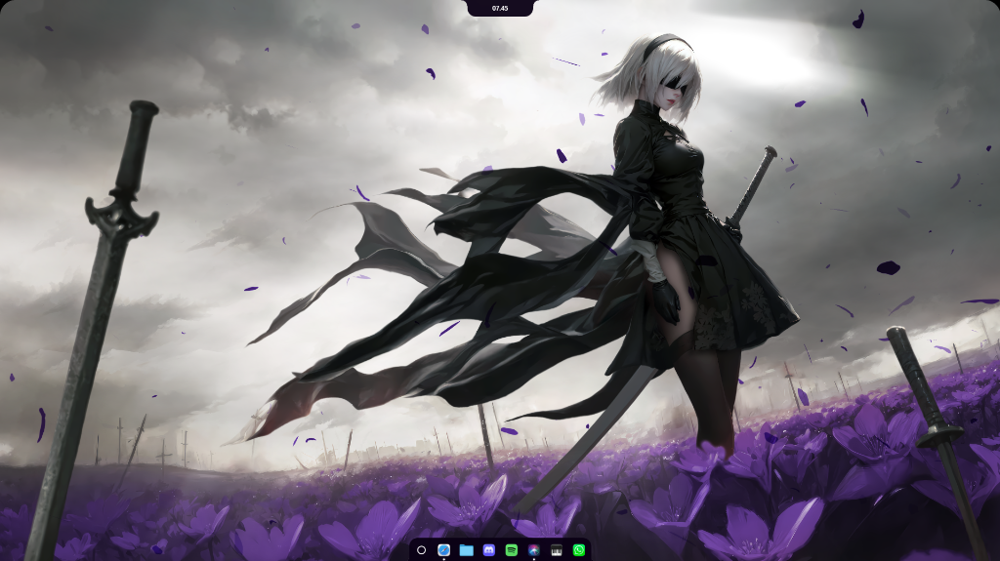

<div align="center">


# Roses

<br/>

<!-- HERO SHOWCASE — full-width cinematic shot or video -->


</div>

---

Roses makes your Windows desktop feel alive.

Every transition is a physics simulation.
Every element responds to touch.
Every pixel is in motion.

Your desktop has been asleep for years.
This wakes it up.

---

## The Island

<!-- SHOWCASE: GIF or short clip — Island expanding, cycling through modes (3-5s) -->
<p align="center">
  
</p>

A notch at the top of your screen that adapts to what you're doing.

Scroll or swipe to switch modes.
Watch it transform.

**Music** — album art, track info, playback controls. A visualizer that reacts to five frequency bands with spring physics. It moves when the music plays.

**Command Center** — WiFi, Bluetooth, Do Not Disturb, volume, brightness. Everything you usually dig through settings for.

**Status** — Battery, weather. Your desktop, summarized.

**Calendar** — A month view with a Pomodoro timer. Focus without switching apps.

Each transition is spring-loaded.
Width, height, border-radius, position — all animate independently.
It feels mechanical. In a good way.

---

## The Dock

<!-- SHOWCASE: GIF — dock appearing on hover, drag-reorder, window previews -->
<p align="center">
  
</p>

A taskbar that actually moves.

Roses replaces your native Windows taskbar.
It sits at the bottom of your screen, always there when you need it.

Drag to reorder.
Hover for window previews.
Right-click for context menus.

It's not an overlay.
It _is_ your taskbar.

---

## Multi-Monitor & High-Priority Startup

- **Target Display Selector**: Choose which monitor Roses attaches to (Monitor 1, Monitor 2, etc.) in **Settings > General**.
- **Instant High-Priority Startup**: Run Roses with zero startup delay via Windows Task Scheduler and elevated runlevel so it boots first at logon.
- **Silent Boot**: Starts seamlessly without annoying pop-ups on logon.

---

## Under the Hood

A Rust backend that speaks directly to the Windows shell.

Global hooks intercepting keys before Windows sees them.
WASAPI capturing system audio in real-time.
COM controlling your media sessions.
WMI monitoring your hardware.

The whole thing sleeps when you don't need it.
The audio visualizer pauses when nothing's playing.
The cursor monitor hides when the dock is gone.
Thumbnails only refresh on focus.

It's fast because it has to be.

---

## 🛡️ Microsoft Defender

Some users may see a Microsoft Defender warning when installing Roses.

The executable was submitted directly to Microsoft for analysis. Microsoft reviewed the file and confirmed that it **does not meet their criteria for malware or potentially unwanted applications**, and **the detection has been removed**.

<p align="center">
  
</p>

<details>
<summary>Still seeing the detection?</summary>

Your system may still have the previous Defender signature cached. Microsoft recommends updating your Defender security intelligence.

Open **Command Prompt as Administrator** and run:

```cmd
cd "C:\Program Files\Windows Defender"
MpCmdRun.exe -removedefinitions -dynamicsignatures
MpCmdRun.exe -SignatureUpdate
```

</details>

## Get It Running

**Download** the latest build from [Releases](https://github.com/ddolls/Roses_Windows-11/releases/latest).

Or build from source:

```bash
git clone https://github.com/ddolls/Roses_Windows-11.git
cd Roses_Windows-11
npm install
npm run build
npx tauri dev
```

You'll need [Rust](https://rustup.rs/) and [Node.js](https://nodejs.org/) / [Bun](https://bun.sh/). That's it.

---

## Contributing

Roses is open source.
Found a bug? Open an issue.
Have an idea? Send a PR.
Want to just say it's cool? A star goes a long way.

Licensed under [GPLv3](LICENSE).

---

<div align="center">

**Your desktop is waiting.**

</div>
